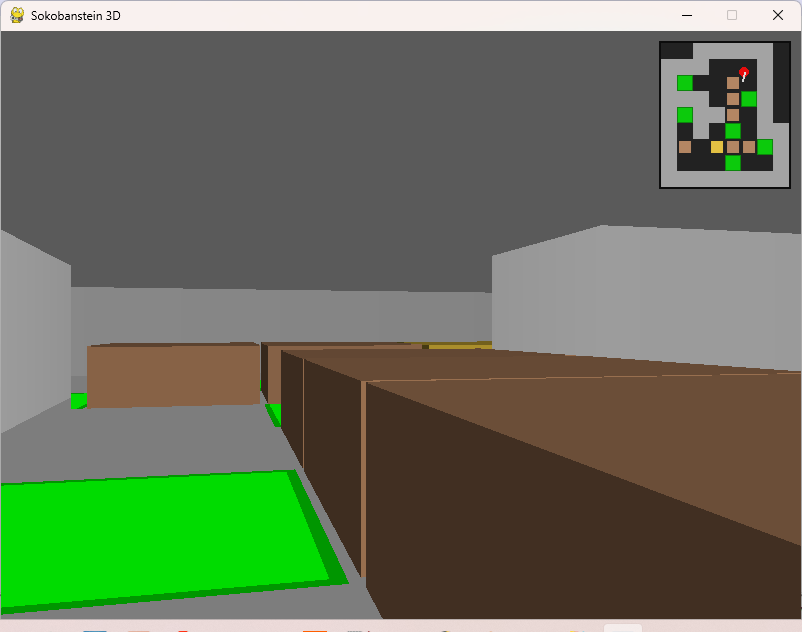

# Sokobanstein 3D

A first-person Sokoban game featuring a retro, Wolfenstein 3D–inspired visual style, with a hybrid raycasting engine for the walls and true 3D objects for the boxes. I developed it by guiding a large language model through hundreds of iterations. While the LLM provided the foundational code, my role was to shape the vision, debug complex issues, and steer the project to completion.



## Installation

To get the game up and running, follow these steps:

1.  **Clone the repository:**
    ```bash
    git clone https://github.com/carlos-montiers/sokobanstein-3d.git
    cd sokobanstein3d
    ```

2.  **Install dependencies:**
    The project relies on Pygame. You can install it using `pip` and the `requirements.txt` file:
    ```bash
    pip install -r requirements.txt
    ```

---

## Usage

Once installed, you can run the game from your terminal.

1.  **Run with the embedded default level:**
    ```bash
    python soko.py
    ```

2.  **Run with a custom XSB level file:**
    You can provide a path to your own Sokoban level file (in the standard `.xsb` format) as a command-line argument:
    ```bash
    python soko.py path/to/your_custom_level.xsb
    ```
---

## XSB File Format

Ensure your `.xsb` file is correctly formatted using the following symbols:

- `#` — wall
- `-` or (space) — floor
- `$` — box
- `.` — goal
- `@` — player
- `*` — box on goal
- `+` — player on goal

## Controls

* **Arrow Keys:** Turn and move the player.
* **U** or **Z:** Undo the last move.
* **R:** Restart the current level.
* **C:** Snap the player's view to the nearest cardinal angle (North, South, East, West).
* **Esc:** Quit the game.

---

## License

This project is open-sourced under the **MIT License**. Feel free to fork the repository, experiment with the code, and extend its capabilities!
